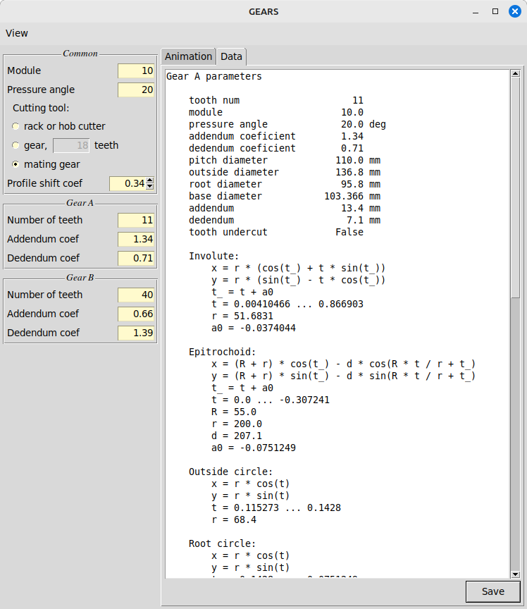

# Description
The app computes gear profile and a bunch ob parameters, such as pitch diameter, outside diameter, root diameter, base
diameter, addendum, dedendum, tooth undercut, and the average contact points number. It supports animation of the
transmission for visual inspection. Parametric equations of the tooth curves (involute, epitrochoid, root circle, outer
circle) are also available. They can be used for modeling of the gears in CAD systems. The models, in turn, can be
printed out by 3D printer, or used for further simulation / investigation of the mechanical properties, e.g. mechanical
deformation under load, weight, etc., depending on the needs and capabilities of the available CAD system.

__Contact zoom-in:__


__Tooth structure:__


# Build
Clone the repository, or download it as archive and unzip. Go to the directory with ```pyproject.toml``` file and run
```
python -m build
```
It will generate the ```dist``` directory.

# Installation
After the build is finished, go to the directory with ```pyproject.toml``` file and run
```
python -m pip install "dist/gears-0.1.0.tar.gz"
```

# Run
```
python -m gears
```
Alternatively, go to the directory with ```pyproject.toml``` file, and run
```
python run.py
```
In the last case installation is not required.

# Uninstall
```
pip uninstall gears
```

# Usage
In brief, input the gear parameters, and click the __PLAY__ button .


Animation will be started immediately, and the data tab is filled out with textual output. To start a new simulation
with another parameters, first click the __STOP__ button .

## Menu bar
### View menu
Using the dropdown view menu, the plot components can be displayed or hidden:
* Gear A
* Gear B
* Action line
* Contact points
* Rack

## Sidebar
Invalid input data is marked with pink background. User cannot start new simulation with invalid data (the
[__PLAY__](src/gears/images/play.png) button is disabled).

### Common
_module_ = _pitch diameter_ / _number of tooth_. Roughly speaking, it is the size of tooth.

The _pressure angle_ is the angle at the pitch point between the action line and the tangent to the pitch circle.

Сhoiсe of the cutting tool affects the shape of epitrochoid. To avoid pinion tooth undercut (find it in the __Data__
tab), select the proper
_Profile shift coef_. If to click __Up__ and __Down__ buttons, addendums and dedendums instantly follow changes of
_Profile shift coef_. However, if the later should be changed alone, please enter the value from the keyboard.

### Gear A / B
The _number of teeth_ should be integer.

_addendum coef_ = _addendum_ / _module_

_dedendum coef_ = _dedendum_ / _module_

If _dedendum A_ equals _addendum B_ and vice versa (default settings), there is the tightest possible contact between
gears, so then their corners touch epitrochoids of the mating gear. In practical machinery, some extra value is added
to the dedendum.

## Animation tab
The tab shows animated gear transmission. It constitutes an embedded Matplotlib plot, which is controlled by the
standard toolbar
with a few extra buttons to support video. Animation can be paused , resumed
, stopped  or scrolled manually
 frame by
frame. The defauld Matplotlib buttons are:
* Reset original view
* Back to previous view
* Forward to next view
* Left button pans
* Zoom to rectangle
* Configure subplots
* Save the figure

## Data tab
The equations of the tooth curves are given in the parametric form, where _x_ and _y_ are curve point coordinates in mm,
_t_ is the variable parameter given as a range, and _t__ is the auxiliary variable computed out of _t_. The rest is
constants.



Scroll down to see the _average contact points number_. The latter is important for the transmission quality (the
higher, the better, but should not be lower than 1).

Click on the __SAVE__ button to save output in the _.txt_ format.[README.md](..%2FChemicalStructureEditor%2FREADME.md)

# Roadmap
* Inner gears
* Asymmetrical teeth
* Bevel gears
